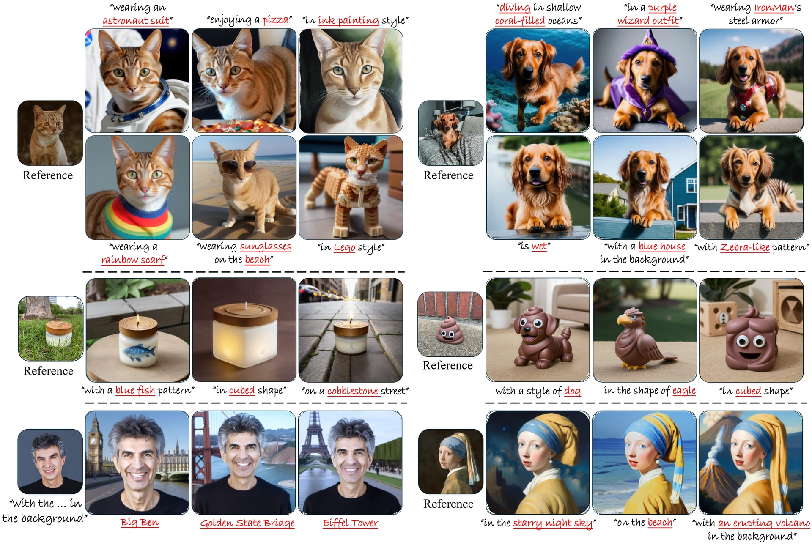

# DisEnvisioner: Disentangled and Enriched Visual Prompt for Customized Image Generation

[](https://disenvisioner.github.io/)
[](https://arxiv.org/abs/2410.02067)
[](https://huggingface.co/spaces/haodongli/DisEnvisioner)

[Jing He](https://scholar.google.com/citations?hl=en&user=RsLS11MAAAAJ)<sup>1<span style="color:red;">&#10033;</span></sup>,
[Haodong Li](https://haodong-li.com/)<sup>1<span style="color:red;">&#10033;</span></sup>,
[Yongzhe Hu]()<sup></sup>,
[Guibao Shen](https://scholar.google.com/citations?user=d8VVM4UAAAAJ&hl=en)<sup>1</sup>,
[Yingjie Cai](https://yjcaimeow.github.io/)<sup>3</sup>,
[Weichao Qiu](https://weichaoqiu.com/)<sup>3</sup>,
[Ying-Cong Chen](https://www.yingcong.me/)<sup>1,2&#9993;</sup>

<span class="author-block"><sup>1</sup>HKUST(GZ)</span>
<span class="author-block"><sup>2</sup>HKUST</span>
<span class="author-block"><sup>3</sup>Noah's Ark Lab</span><br>
<span class="author-block">
    <sup style="color:red;">&#10033;</sup><strong>Both authors contributed equally.</strong>
    <sup>&#9993;</sup>Corresponding author.
</span>


We present **DisEnvisioner**, without cumbersome tuning or relying on multiple reference images, DisEnvisioner is capable of generating a variety of exceptional customized images. Characterized by its emphasis on the interpretation of subject-essential attributes, DisEnvisioner effectively discerns and enhances the subject-essential feature while filtering out irrelevant attributes, achieving superior personalizing quality in both editability and ID consistency.

## 📢 News
- 2024-10-25: The inference code is now available. 
- 2024-10-04: [Paper](https://arxiv.org/abs/2410.02067) released. 

## 🛠️ Setup
We have tested the inference code on: Ubuntu 20.04 LTS, Python 3.9, CUDA 12.3, NVIDIA A800-SXM4-80GB.

1. Clone the repository (requires git):
```
git clone https://github.com/EnVision-Research/DisEnvisioner.git
cd DisEnvisioner
```
2. Install dependencies (requires conda):
```
conda create -n disenvisioner python=3.9 -y
conda activate disenvisioner
pip install -r requirements.txt 
```

## 🕹️ Usage
### Download pre-trained models
```bash
# make sure you have git-lfs installed (https://git-lfs.com)
git lfs install
git clone https://huggingface.co/jingheya/disenvisioner_models
```

### Test on your own images
You can use the following script to generate customized images or run `run_disenvisioner.sh` directly.
```bash
CUDA_VISIBLE_DEVICES=0 python run_disenvisioner.py \
    --pretrained_model_name_or_path "SG161222/Realistic_Vision_V4.0_noVAE" \
    --pretrained_CLIP "openai/clip-vit-large-patch14" \
    --half_precision \
    --resolution 512 \
    --seed 42 \
    --num_samples 5 \
    --scale_object $SOBJ \
    --scale_others 0.0 \
    --disvisioner_path $DV_PATH \
    --envisioner_path $EV_PATH \
    --infer_image $IMAGE_PATH \
    --class_name $CLASS_NAME \
    --infer_prompt $PROMPT \
    --output_dir $YOUR_OUTDIR
```
- `$SOBJ`: The scale for the customized object. Default: 0.7. 
- `$DV_PATH`: The path of pre-trained disvisioner model. Default: disenvisioner_models/disenvisioner/disvisioner.pt. 
- `$EV_PATH`: The path of pre-trained envisioner model. Default: disenvisioner_models/disenvisioner/envisioner.pt. 
- `$IMAGE_PATH`: The path of the input image which contains your customized object. 
- `$CLASS_NAME`: The class name of your customized object. 
- `$PROMPT`: Editing prompt. 
- `$YOUR_OUTDIR`: The output directory.


(Optional) For non-live objects, we recommand running the following script, which incorporates the weights of [IP-Adapter](https://github.com/tencent-ailab/IP-Adapter), to enhance object details and improve ID consistency. You can also run `run_disenvisioner_w_ip.sh` directly. 
```bash
CUDA_VISIBLE_DEVICES=0 python run_disenvisioner_w_ip.py \
    --pretrained_model_name_or_path "SG161222/Realistic_Vision_V4.0_noVAE" \
    --pretrained_CLIP "openai/clip-vit-large-patch14" \
    --ip_image_encoder_path "disenvisioner_models/image_encoder" \
    --half_precision \
    --resolution 512 \
    --seed 42 \
    --num_samples 1 \
    --scale_object $SOBJ \
    --scale_others 0.0 \
    --scale_ip $SIP \
    --disvisioner_path $DV_PATH \
    --envisioner_path $EV_PATH \
    --infer_image $IMAGE_PATH \
    --class_name $CLASS_NAME \
    --infer_prompt $PROMPT \
    --output_dir $OUTDIR 
```
- `$SIP`: The scale of the image embedding from IP-Adapter. 


## 🖼️ Generation Examples
Here, we provide some example results. The first column is the input image. 

For the input image: `assets/example_inputs/dog.jpg` :
<details open>
<summary>dog/"best quality, high quality, a dog is running"/scale_object=0.7/seed=42</summary>


</details>

<details open>
<summary>dog/"best quality, high quality, a dog standing in front of a fountain"/scale_object=0.7/seed=42</summary>


</details>

<details>
<summary>dog/"best quality, high quality, a dog with Zebra-like pattern"/scale_object=0.7/seed=42</summary>


</details>

<details>
<summary>dog/"best quality, high quality, a dog in a purple wizard outfit"/scale_object=0.7/seed=42</summary>


</details>
<br>


## 🎓 Citation
If you find our work useful in your research, please consider citing our paper:
```
@article{he2024disenvisioner,
    title={DisEnvisioner: Disentangled and Enriched Visual Prompt for Customized Image Generation},
    author={Jing He and Haodong Li and Yongzhe Hu and Guibao Shen and Yingjie Cai and Weichao Qiu and Ying-Cong Chen},
    journal={arXiv preprint arXiv:2410.02067},
    year={2024}
}
```
